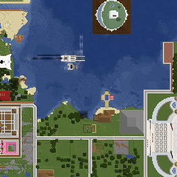

# FoxelMap

FoxelMap is a (as of now crude) python command-line offline 1.16.5 VoxelMap renderer that attempts to provide a customizable offline option for rendering voxelmap cache files, as well as adding extra modes and settings:

As of now it supports most but not all blockstates (namely waterlogged blocks). It also does not match voxelmap output 1:1 (and likely never will).

## Usage

Copy the 1.16 Minecraft `.jar` assets directory into the root folder of FoxelMap and copy the VoxelMap cache files of the world and dimension you wish to render into the `world/` folder.

To render the center regions of the world do `python foxelmap.py -x "-1,0" -z "-1,0" --stitch`, the output should then appear in `out/`!

Run `python foxelmap.py --help` for a list of all commands.

### Area Selection

Voxelmap stores its cache data in tiles each corresponding to a 256x256 area (as opposed to the 512x512 of minecraft's region files). Several commands are available for picking which tiles to render with Foxelmap.

| Command            | Description                                                  |
| ------------------ | ------------------------------------------------------------ |
| `--world <path>`   | The path to the folder with the .zip tiles to be rendered, `world/` is the default if no world setting is specified |
| `-a` / `--all`     | Render all tiles in the cache                                |
| `-c "x,z"`         | Renders the tile at the specified x,z in-game coordinate     |
| `--cx "x1,x2"`     | Renders the tiles between the specified x in-game coordinates (inclusive) |
| `--cz "z1,z2"`     | Renders the tiles between the specified z in-game coordinates (inclusive) |
| `-x "x1,x2"`       | Renders the tiles between the specified x voxelmap tile coordinates (inclusive) |
| `-z "x1,x2"`       | Renders the tiles between the specified z voxelmap tile coordinates (inclusive) |
| `--radius <value>` | Expands the selected tile area by a specified radius in all directions |

### Render Modes

| Command          | Description                                             |
| ---------------- | ------------------------------------------------------- |
| `--mode terrain` | The standard Voxelmap-like look                         |
| `--mode height`  | A grayscale map where pixel brightness = y              |
| `--mode light`   | À grayscale map showing the block light level           |
| `--mode land`    | A map showing the water and land boundaries             |
| `--mode biome`   | A map of the different biomes using Amidst color values |
| `--mode none`    | Performs no render                                      |

#### Render Settings

| Command                                | Description                                                  |
| -------------------------------------- | ------------------------------------------------------------ |
| `--light <day/night/nether/end/gamma>` | When in `--mode terrain`, selects the light level to use for rendering |
| `--bedrock`                            | When in `--mode terrain`, uses minecraft bedrock edition water colors |
| `--heightslice <value>`                | When in `--mode height` rounds the values of y coordinates to intervals of the specified value to create a layered topographic look |
| `--layer`                              | In all modes, renders a single Voxelmap layer (0 = Surface, 1 = Underwater, 2 = Transparent Blocks, 3 = Vegetation) |

### Output Settings

| Command          | Description                                                  |
| ---------------- | ------------------------------------------------------------ |
| `--zoom <value>` | Creates folders with zoomed out versions of the tiles, every 4 tiles in a certain zoom level get merged and shrunk into a single 256x256 tile at the next zoom level |
| `--stitch`       | Stitches all the produced tiles into a single image, if zoom is used, it will use the highest zoom level |
